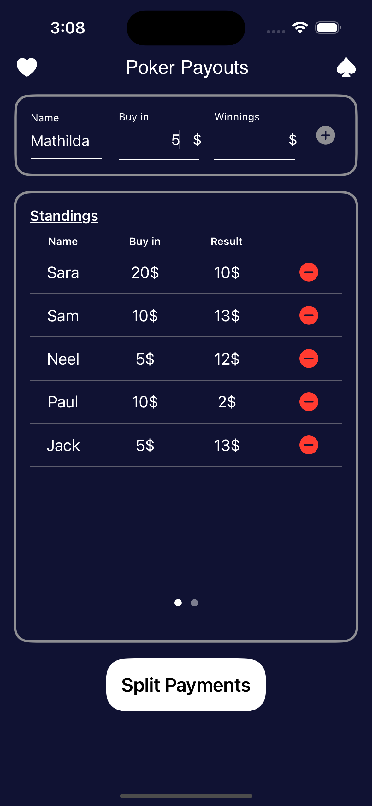
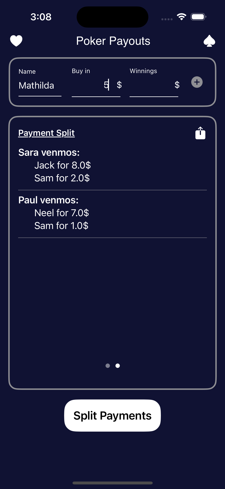
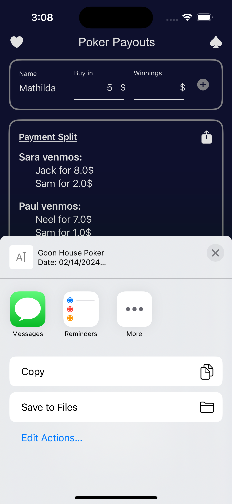

# Poker Payouts Swift

## Description
Poker Payouts Swift is a Swift-based application designed to simplify the process of tracking poker winnings and calculating the optimal payment splits among players. The app provides a user-friendly interface for entering individual player winnings and computes how the total pot should be distributed to ensure fairness and transparency. Integrated with Google Cloud's serverless functions, the app offloads complex calculations to the cloud, ensuring scalability and efficiency.

## Features
- **Player Winnings Tracking**: Easily input each player's winnings at the end of your poker sessions.
- **Optimal Payment Split Calculation**: The app calculates how winnings should be distributed among players to ensure everyone gets their fair share.
- **Cloud-Powered Calculations**: Utilizes Google Cloud serverless functions for handling computation-intensive tasks, providing reliable and scalable performance.
- **Intuitive User Interface**: The app features a clean and straightforward UI, making it easy for users to input data and understand their splits.
- **SwiftUI Implementation**: Built using SwiftUI for a responsive and platform-native experience on iOS devices.

## Getting Started
To get started with PokerPayoutsSwift, clone the repository to your local machine. Ensure you have the latest version of Xcode installed to open and run the project. Familiarity with Swift and SwiftUI is recommended for navigating and modifying the codebase.

### Prerequisites
- Xcode 12.0 or later
- Swift 5.3 or later
- An active Google Cloud account for setting up serverless functions

## Components
- `apiConnector.swift`: Handles communication with Google Cloud serverless functions for processing the winnings and split calculations.
- `ContentView.swift`: The main content view of the app, displaying the user interface for input and results.
- `fieldEnter.swift`: Manages the input fields for entering player names and their corresponding winnings.
- `listEditor.swift`: Allows users to add, remove, or edit the list of players participating in the game.
- `PokerPayoutsSwift.swift`: The main app file that initializes the application and sets up the primary view.
- `resultDisplay.swift`: Displays the calculated splits and any other relevant results to the users.

## Usage
1. Open the project in Xcode.
2. Configure the `apiConnector.swift` file with your Google Cloud serverless function endpoint.
3. Run the app in the Xcode simulator or on a physical device.
4. Enter the winnings for each player and submit to receive the calculated splits.

## Screenshots

Here are some screenshots to give you a glimpse into what Poker Payouts Swift looks like in action:

  
   
  <em>Main Interface - Where you enter player winnings</em>

  
   
  <em>Results Display - View detailed split calculations and share them with your players.</em>

  
   
  <em>Results Display - Share a text summary of winnings to your friends.</em>

## Contributing
Contributions are welcome! Feel free to fork the repository, make changes, and submit pull requests. If you find any bugs or have suggestions for new features, please open an issue in the repository.

